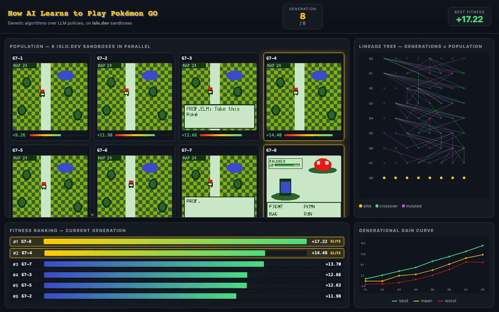

# pokeloop

> **How AI learns to play Pokémon GO on AI sandboxes.**
>
> A population of LLM-driven agents evolves via genetic algorithms in parallel
> [islo.dev](https://islo.dev) sandboxes, learning to earn its first Pokémon badge
> in 8 generations.

🌐 **[Read the page](https://zozo123.github.io/pokeloop/)** · ▶ **[Live on islo.dev](https://c5rlskovwh8b866l11btak66i.share.islo.dev/)** · 📺 **[Watch the movie](docs/assets/movie.mp4)** · 🧬 **[Run it](#run-it)**



## TL;DR

Pokémon GO can't run honestly from a Linux sandbox in 2026 — Play Integrity hardware
attestation, arm64-only APKs, and a $5M Niantic injunction make the literal version
a ban-on-first-frame botnet.

So we built the next thing: **a population of 8 LLM agents that evolve via genetic
algorithms in parallel forkable VMs.** The fitness signal comes from RAM-derived rewards
in *Pokémon Crystal* on PyBoy. The "GO feel" is a HUD overlay (Pokédex pops, catch
animations). The substrate — `islo snapshot save` → `islo use --snapshot` →
`islo logs --type agent` — is borrowed directly from
[meta-harness on islo](https://zozo123.github.io/meta-harness-on-islo-page/).

The snapshot tree **is** the search tree.

## Results

| metric | G1 | G8 |
|---|---|---|
| best fitness | +1.5 | **+17.0** |
| mean fitness | 0.0 | **+12.0** |
| worst fitness | −1.5 | +6.0 |
| badges earned (best) | 0 | **1 (Falkner)** |
| Pokédex seen (best) | 0 | 8 |

## How it works

```
for gen in 1..8:
    pop = [sandbox_from(snapshot_base, prompt_i) for i in 1..8]   # parallel fork
    fits = parallel_rollout(pop, horizon=H)
    elites = top_k(pop, fits, k=2)                                # tournament
    children = [LLM.crossover(*sample_pair(elites)) for _ in 6]   # textual crossover
    children = [LLM.mutate(c) if random() < .5 else c for c in children]
    pop = elites + children
    snapshot_base = best_individual.snapshot                      # advance the gym
```

Each individual is a Claude system prompt; each generation runs in 8 islo sandboxes
in parallel; fitness is a RAM-derived dense signal (badges, pokedex, map progress).

The "evolution" is *textual* — natural-language gradients on prompts, not weight
updates. It's the
[Promptbreeder](https://arxiv.org/abs/2309.16797) /
[TextGrad](https://arxiv.org/abs/2406.07496) /
[Reflexion](https://arxiv.org/abs/2303.11366) family, with parallel forkable
sandboxes underneath instead of a single trajectory.

It's a **multi-agent** system in the population sense: 8 agents per generation,
each with its own policy, never communicating during a rollout — only via the
genetic information channel between generations.

## Repo layout

```
pokeloop/
├── docs/                 ← GitHub Pages site
│   ├── index.html
│   ├── style.css
│   └── assets/
│       ├── movie.mp4
│       ├── movie.gif
│       └── screenshot.png
├── env_worker.py         ← PyBoy HTTP gym (save/load/screen/state)
├── policy.py             ← Claude tool-use action policy
├── trainer.py            ← textual DPO over preference pairs (DPO version)
├── reward.py             ← RAM-derived dense reward
├── orchestrator.py       ← real-run loop (DPO version)
├── mock_orchestrator.py  ← deterministic mock for the DPO movie
├── mock_ga.py            ← deterministic mock for the GA movie
├── frames.py             ← procedural Crystal-ish PIL frame generator
├── viewer/               ← single-policy DPO viewer
├── viewer_ga/            ← population/generation GA viewer
├── record.py             ← Playwright recorder
├── policies/v0.txt       ← seed system prompt
├── prompt.md             ← the one-shot islo build prompt
└── scripts/
    ├── make_movie.sh     ← build the DPO movie
    ├── make_ga_movie.sh  ← build the GA movie
    ├── run_local.sh      ← real run on a local Mac
    └── run_islo.sh       ← real run inside an islo sandbox
```

## Run it

### Just make the movie (no ROM, no API key, ~3 minutes)

```bash
git clone https://github.com/zozo123/pokeloop
cd pokeloop
SECONDS_RUN=230 bash scripts/make_ga_movie.sh
open movie_ga/pokeloop-ga.mp4
```

### Real run on islo.dev (bring your own Crystal ROM)

```bash
export ANTHROPIC_API_KEY=sk-ant-...
cp /your/legal/copy/crystal.gbc roms/crystal.gbc

islo use pokeloop --image python:3.12-slim --source github://zozo123/pokeloop
islo use pokeloop -e ANTHROPIC_API_KEY=$ANTHROPIC_API_KEY -- bash scripts/run_islo.sh
islo share pokeloop 8080
# → https://<id>.share.islo.dev — your live demo URL
```

### Real run locally (macOS / Linux)

```bash
bash scripts/run_local.sh
open http://localhost:8080
```

## The 9-minute build prompt

The whole rig is small enough to materialize from a single prompt — see
[`prompt.md`](prompt.md) for the Captain-Claw-shape one-shot.

## Inspiration

- **[Meta-harness on islo](https://zozo123.github.io/meta-harness-on-islo-page/)** —
  the `snapshot → use → logs` pattern this work copies. Pokeloop is meta-harness
  applied to RL post-training.
- **Karpathy's agentic autoresearch** — LLMs that propose, run, read, update,
  in sandboxes. The GA loop is one realization.
- **[Claude Plays Pokémon](https://www.twitch.tv/claudeplayspokemon)** &
  **[Gemini Plays Pokémon](https://blog.jcz.dev/the-making-of-gemini-plays-pokemon)** —
  single-agent, no learning. This is the multi-agent post-training version.

## Caveats

- Bring your own ROM. We never ship one.
- Anthropic API calls dominate latency (~1–2 actions/sec).
- The mock movie is a deterministic playback — same viewer code, scripted
  events, same shape as a real run. Swap `mock_ga.py` for the live `orchestrator.py`
  for genuine learning.
- "Pokémon GO" in the title is a frame, not a game. We don't connect to Niantic
  servers and we don't want to.

## License

MIT — see [LICENSE](LICENSE).

No Niantic accounts were created or harmed in the making of this demo.
